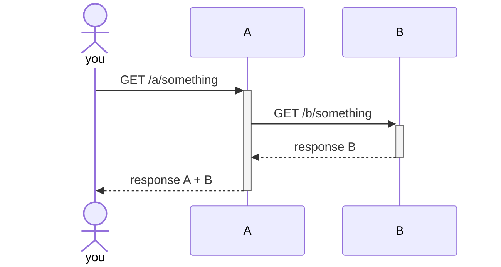
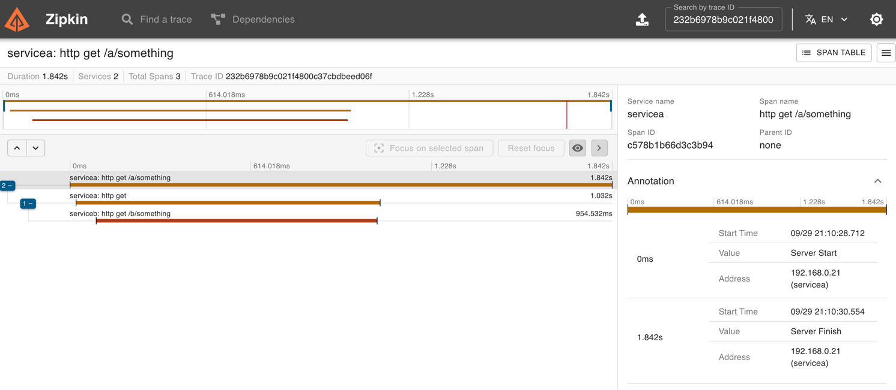

# Simple Observability Demo

For this simple demo we'll use the following technologies/tools:
- Spring Boot WebFlux.
- Micrometer with Open Telemetry (OTLP).
- ~~Zipkin~~ Grafana Tempo for traces.
- Prometheus for metrics.
- Grafana to visualisation

This is just a simple observability demo. There are 2 services A and B, as shown in the diagram below:



We want the following:
1. Generate a Trace ID and a Span ID everytime the API A is hit.
2. Propagate the Trace ID and Span ID from A to B, so we can track the whole request end-to-end.
3. Traces are sent to Zipkin
4. Metrics are collected by Prometheus

To test, run:
1. run the containers for Zipkin / Prometheus / Grafana
```shell
docker compose -f docker-compose.yml up -d
```
2. run service A
```shell
$ cd service-a
$ mvn spring-boot:ru
```
3. run service B
```shell
$ cd service-b
$ mvn spring-boot:ru
```
4. hit http://localhost:8081/a/something

You'll see something like:
- Logs from A:
```log
2025-09-29T21:10:28.732+01:00  INFO 21268 --- [serviceA] [ctor-http-nio-3] [232b6978b9c021f4800c37cbdbeed06f-c578b1b66d3c3b94] c.g.e.observability.ControllerA          : enter something
2025-09-29T21:10:28.732+01:00  INFO 21268 --- [serviceA] [ctor-http-nio-3] [232b6978b9c021f4800c37cbdbeed06f-c578b1b66d3c3b94] c.g.e.observability.ServiceBClient       : enter callB
2025-09-29T21:10:29.767+01:00  INFO 21268 --- [serviceA] [ctor-http-nio-3] [232b6978b9c021f4800c37cbdbeed06f-c578b1b66d3c3b94] c.g.e.observability.ServiceBClient       : exit callB: response=response from B at 2025-09-29T21:10:28.810337
2025-09-29T21:10:30.550+01:00  INFO 21268 --- [serviceA] [     parallel-1] [232b6978b9c021f4800c37cbdbeed06f-c578b1b66d3c3b94] c.g.e.observability.ControllerA          : exit something: response=<200 OK OK,response from A at 2025-09-29T21:10:29.767876 - response from B at 2025-09-29T21:10:28.810337,[]>
```

- Logs from B:
```log
2025-09-29T21:10:28.811+01:00  INFO 21270 --- [serviceB] [ctor-http-nio-2] [232b6978b9c021f4800c37cbdbeed06f-49677b6c1ee48cb3] observability.ControllerB                : enter something
2025-09-29T21:10:29.735+01:00  INFO 21270 --- [serviceB] [     parallel-1] [232b6978b9c021f4800c37cbdbeed06f-49677b6c1ee48cb3] observability.ControllerB                : exit something: response=<200 OK OK,response from B at 2025-09-29T21:10:28.810337,[]>
```

Then, go to zipkin http://localhost:9411/zipkin/traces/232b6978b9c021f4800c37cbdbeed06f and you'll see something like this:
